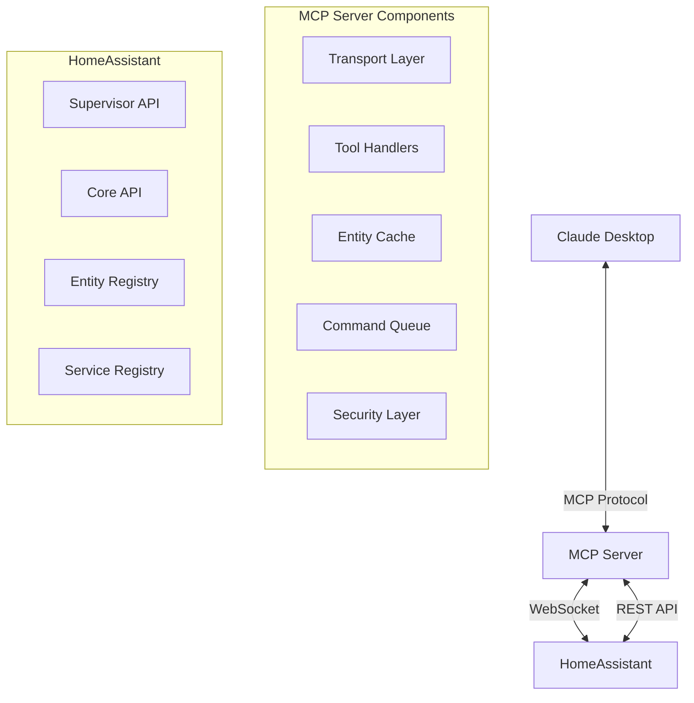

# Architecture Documentation

## System Architecture Overview

The HomeAssistant MCP Server is designed as a bridge between Claude Desktop and HomeAssistant, enabling natural language control of smart home devices through the Model Context Protocol (MCP).



## Core Components

### 1. Transport Layer

The transport layer handles communication between Claude Desktop and the MCP server.

#### SSE Mode (Server-Sent Events)
- **Purpose**: Enable remote connections
- **Port**: 8099
- **Protocol**: HTTP/HTTPS with SSE
- **Authentication**: Bearer token via headers
- **Use Case**: Cloud deployments, remote access

#### Stdio Mode (Standard I/O)
- **Purpose**: Local secure communication
- **Protocol**: JSON-RPC over stdin/stdout
- **Authentication**: Inherited from process
- **Use Case**: Local installations, maximum security

### 2. WebSocket Client

Manages persistent connection to HomeAssistant.

```typescript
class WebSocketClient {
  - Auto-reconnection with exponential backoff
  - Message queuing during disconnection
  - Heartbeat/ping mechanism
  - Event subscription management
  - Authentication flow handling
}
```

**Key Features:**
- Reconnection strategy: Exponential backoff (1s, 2s, 4s... max 30s)
- Queue capacity: 1000 messages
- Heartbeat interval: 30 seconds
- Timeout handling: 60 seconds

### 3. Tool System

Four main tool categories expose HomeAssistant functionality:

#### get_entities
- **Purpose**: Retrieve entity information
- **Caching**: 60-second TTL
- **Filtering**: By domain, state, area
- **Pagination**: Supports large entity lists

#### control_device
- **Purpose**: Execute service calls
- **Validation**: Schema validation before execution
- **Rate Limiting**: 100 requests/minute
- **Confirmation**: Optional for critical actions

#### get_services
- **Purpose**: Discover available services
- **Dynamic**: Reflects current HA capabilities
- **Documentation**: Includes parameter schemas

#### query_history
- **Purpose**: Access historical data
- **Time Range**: Configurable windows
- **Aggregation**: Statistics support
- **Performance**: Batched queries

### 4. Security Architecture

Multi-layered security approach:

```
┌─────────────────────────┐
│   Authentication Layer   │ - Token validation
├─────────────────────────┤
│   Authorization Layer    │ - Entity permissions
├─────────────────────────┤
│    Rate Limiting Layer   │ - Request throttling
├─────────────────────────┤
│    Validation Layer      │ - Input sanitization
├─────────────────────────┤
│     Audit Layer         │ - Action logging
└─────────────────────────┘
```

#### Security Features
1. **Token Management**
   - Long-lived tokens only
   - Secure storage in environment
   - Token rotation support
   - Revocation handling

2. **Entity Filtering**
   - Domain-based restrictions
   - Entity ID allow/block lists
   - Sensitive entity protection
   - Area-based access control

3. **Input Validation**
   - JSON schema validation
   - HTML/script sanitization
   - SQL injection prevention
   - Command injection protection

4. **Rate Limiting**
   - Per-minute limits (configurable)
   - Circuit breaker pattern
   - Graceful degradation
   - Burst allowance

### 5. Caching Strategy

Intelligent caching reduces load on HomeAssistant:

```typescript
interface CacheStrategy {
  entities: {
    ttl: 60,  // seconds
    maxSize: 10000,
    invalidation: 'time-based'
  },
  services: {
    ttl: 300,
    maxSize: 1000,
    invalidation: 'event-based'
  },
  history: {
    ttl: 3600,
    maxSize: 100,
    invalidation: 'manual'
  }
}
```

**Cache Invalidation Triggers:**
- State change events
- Service registry updates
- Manual refresh commands
- TTL expiration

### 6. Error Handling

Comprehensive error handling with recovery strategies:

```typescript
enum ErrorStrategy {
  RETRY_WITH_BACKOFF,    // Transient network errors
  QUEUE_FOR_RETRY,       // Service temporarily unavailable
  FALLBACK_TO_CACHE,     // Use cached data if available
  CIRCUIT_BREAK,         // Repeated failures
  FAIL_FAST,            // Critical errors
  GRACEFUL_DEGRADE      // Partial functionality
}
```

**Error Categories:**
1. **Network Errors**: Auto-retry with backoff
2. **Authentication Errors**: Token refresh attempt
3. **Entity Errors**: Validate and suggest alternatives
4. **Service Errors**: Queue and retry
5. **Rate Limit Errors**: Throttle and queue

## Data Flow Architecture

### Request Flow

```
Claude Desktop
    ↓ (MCP Request)
Transport Layer
    ↓ (Parse & Validate)
Security Layer
    ↓ (Authenticate & Authorize)
Tool Handler
    ↓ (Check Cache)
Cache Layer
    ↓ (Cache Miss)
WebSocket Client
    ↓ (HA API Call)
HomeAssistant
    ↓ (Response)
Response Processing
    ↓ (Update Cache)
Format Response
    ↓ (MCP Response)
Claude Desktop
```

### Event Flow

```
HomeAssistant
    ↓ (State Change Event)
WebSocket Client
    ↓ (Event Received)
Event Processor
    ↓ (Filter & Validate)
Cache Invalidator
    ↓ (Update Cache)
Subscription Manager
    ↓ (Notify Subscribers)
Claude Desktop
```

## Deployment Architecture

### Container Structure

```dockerfile
/addon/
├── /dist/           # Compiled JavaScript
├── /node_modules/   # Dependencies
├── /config/         # Configuration files
├── /ssl/           # SSL certificates
└── /data/          # Persistent data
```

### Process Model

```
┌──────────────┐
│   Supervisor  │
└──────┬───────┘
       │ (manages)
┌──────▼───────┐
│   Container   │
│  ┌─────────┐ │
│  │ Node.js │ │
│  │ Process │ │
│  └─────────┘ │
│               │
│  ┌─────────┐ │
│  │ MCP     │ │
│  │ Server  │ │
│  └─────────┘ │
└───────────────┘
```

### Resource Management

**Memory Management:**
- Max heap: 256MB
- Cache limit: 50MB
- Queue limit: 10MB
- Connection pool: 10 connections

**CPU Management:**
- Single-threaded with async I/O
- Event loop optimization
- Batch processing for bulk operations
- Throttling for CPU-intensive tasks

## Performance Architecture

### Optimization Strategies

1. **Connection Pooling**
   - Reuse WebSocket connections
   - HTTP keep-alive for REST
   - Connection timeout management
   - Graceful connection cycling

2. **Batch Processing**
   - Group entity updates
   - Bulk service calls
   - Aggregated history queries
   - Consolidated cache updates

3. **Async Operations**
   - Non-blocking I/O
   - Promise-based architecture
   - Concurrent request handling
   - Stream processing for large datasets

4. **Memory Optimization**
   - Circular buffers for logs
   - LRU cache eviction
   - Weak references for temporary data
   - Garbage collection tuning

### Scalability Considerations

```yaml
Vertical Scaling:
  - Increase memory allocation
  - Adjust cache sizes
  - Expand queue capacity
  
Horizontal Scaling:
  - Multiple MCP instances
  - Load balancer support
  - Shared cache layer
  - Distributed queue
```

## Integration Architecture

### HomeAssistant Integration

```typescript
interface HAIntegration {
  supervisor: {
    endpoint: 'http://supervisor/core',
    auth: 'Bearer token',
    version: '2023.12+'
  },
  websocket: {
    endpoint: 'ws://supervisor/core/websocket',
    protocol: 'homeassistant.websocket',
    version: 11
  },
  rest: {
    endpoint: 'http://supervisor/core/api',
    auth: 'Bearer token',
    version: 'latest'
  }
}
```

### Claude Desktop Integration

```typescript
interface ClaudeIntegration {
  protocol: 'MCP v1.0',
  transport: ['stdio', 'sse'],
  tools: ['get_entities', 'control_device', 'get_services', 'query_history'],
  capabilities: {
    streaming: false,
    batching: true,
    caching: true
  }
}
```

## Monitoring & Observability

### Metrics Collection

```typescript
interface Metrics {
  performance: {
    response_time: Histogram,
    cache_hit_rate: Gauge,
    queue_size: Gauge,
    active_connections: Counter
  },
  reliability: {
    error_rate: Counter,
    reconnection_count: Counter,
    timeout_count: Counter,
    circuit_breaker_trips: Counter
  },
  usage: {
    requests_per_minute: Gauge,
    unique_entities_accessed: Set,
    service_calls: Counter,
    data_transferred: Counter
  }
}
```

### Logging Architecture

```yaml
Log Levels:
  DEBUG: Development details
  INFO: Normal operations
  WARN: Potential issues
  ERROR: Failures requiring attention
  
Log Targets:
  - Console (container logs)
  - File (persistent storage)
  - Syslog (optional)
  - Metrics endpoint (Prometheus)
```

### Health Checks

```typescript
interface HealthCheck {
  endpoint: '/health',
  checks: {
    websocket: 'connected',
    cache: 'operational',
    queue: 'capacity < 80%',
    memory: 'usage < 200MB',
    rate_limit: 'within_bounds'
  },
  response: {
    status: 'healthy|degraded|unhealthy',
    details: Object,
    timestamp: Date
  }
}
```

## Future Architecture Considerations

### Planned Enhancements

1. **Multi-Instance Support**
   - Shared state management
   - Distributed caching
   - Load balancing

2. **Advanced Caching**
   - Predictive pre-fetching
   - Smart invalidation
   - Compressed storage

3. **Enhanced Security**
   - OAuth2 integration
   - Fine-grained permissions
   - Audit logging

4. **Performance Improvements**
   - WebAssembly modules
   - Native bindings
   - GPU acceleration for ML

### Extension Points

```typescript
interface ExtensionPoints {
  custom_tools: ToolRegistry,
  middleware: MiddlewareStack,
  event_handlers: EventEmitter,
  cache_providers: CacheProvider,
  auth_providers: AuthProvider,
  transport_adapters: TransportAdapter
}
```

## Architecture Decisions Record (ADR)

### ADR-001: Transport Protocol Selection
- **Decision**: Support both SSE and stdio
- **Rationale**: Balance between security and accessibility
- **Consequences**: Additional complexity, broader compatibility

### ADR-002: Caching Strategy
- **Decision**: Time-based TTL with event invalidation
- **Rationale**: Predictable performance, reduced HA load
- **Consequences**: Potential stale data, memory usage

### ADR-003: Security Model
- **Decision**: Token-based with entity filtering
- **Rationale**: HomeAssistant native, granular control
- **Consequences**: Token management overhead

### ADR-004: Error Handling
- **Decision**: Circuit breaker with graceful degradation
- **Rationale**: Resilience and user experience
- **Consequences**: Complex error states, recovery logic

### ADR-005: Deployment Model
- **Decision**: HomeAssistant Add-on architecture
- **Rationale**: Native integration, easy installation
- **Consequences**: Platform lock-in, supervisor dependency